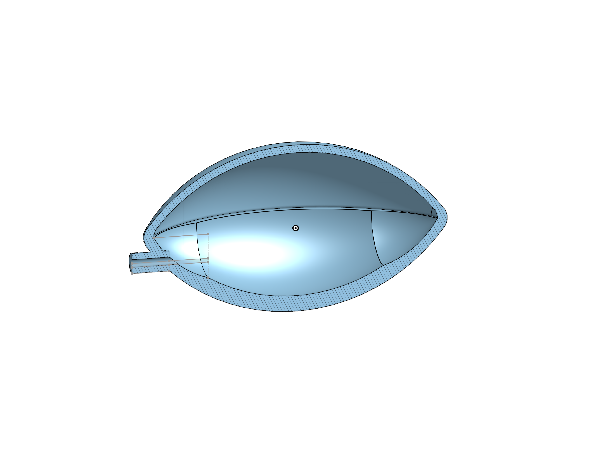

# Smart Anti-Snoring Pillow

This project detects snoring and automatically inflates a cushion to adjust head position. Code is partially adapted from [Snoring-Detection by adrianagaler](https://github.com/adrianagaler/Snoring-Detection).



## Contents
- **`train_snoring_model.ipynb`**: Model training and testing notebook.
- **`training_and_live_testing.ipynb`** (coming soon): Real-time snoring detection.
- **`cushion_image.png`**: Picture of the prototype pillow.
- **Microphone Arduino Sketch** (planned): Handles audio input from the microphone.
- **3D Files** (planned): STL files for 3D-printed components.

## Usage
1. Clone this repository:
   ```bash
   git clone git@github.com:Yann-b-b/Smart_Anti_Snoring_Pillow.git
